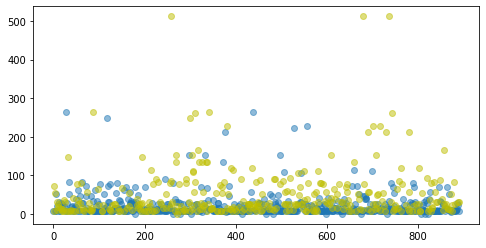
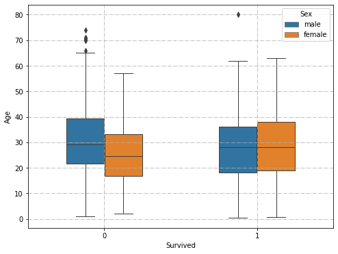

>我们将开始一个专题, 从数据收集, 数据整理, 到建模分析, 结果展示共四个部分, 系统地学习数据分析. (这里我先写**(二)数据整理部分**)
>


## 探索性数据分析简述

探索性数据分析 (Exploratory Data Analysis, 简称 **EDA**), 是指对已有的数据, 通过作图, 制表, 方程拟合等手段探索数据的结构和规律的一种方法. 

EDA 是数据分析中不可或缺的一个步骤, 也是得到原始数据后第一件需要做的事情. 通过 EDA, 研究者能对原始数据的结构, 质量, **规律**有一个大致的了解, 从而得到启发, 更好地进行后续的建模与分析.


## 步骤

### 1. 检查数据总体情况

[数据源-Titanic](https://www.kaggle.com/c/titanic/data)

```python
# 加载所需要的库
import numpy as np
import pandas as pd

# 加载数据
df = pd.read_csv('titanic/train.csv')
df.head(10)  # 看看是否加载正确
```

```python
df.describe()
```

```
       PassengerId    Survived      Pclass         Age       SibSp  \
count   891.000000  891.000000  891.000000  714.000000  891.000000   
mean    446.000000    0.383838    2.308642   29.699118    0.523008   
std     257.353842    0.486592    0.836071   14.526497    1.102743   
min       1.000000    0.000000    1.000000    0.420000    0.000000   
25%     223.500000    0.000000    2.000000   20.125000    0.000000   
50%     446.000000    0.000000    3.000000   28.000000    0.000000   
75%     668.500000    1.000000    3.000000   38.000000    1.000000   
max     891.000000    1.000000    3.000000   80.000000    8.000000   

            Parch        Fare  
count  891.000000  891.000000  
mean     0.381594   32.204208  
std      0.806057   49.693429  
min      0.000000    0.000000  
25%      0.000000    7.910400  
50%      0.000000   14.454200  
75%      0.000000   31.000000  
max      6.000000  512.329200  

```


#### 1.1 缺失值检查与处理

```python
# 方法一
df.info()
# 输出如下, 可以看到, 一共有891个entry(条目), 除了Age, Cabin, Embarked属性, 其他都不含空值
```

```
<class 'pandas.core.frame.DataFrame'>
RangeIndex: 891 entries, 0 to 890
Data columns (total 12 columns):
#   Column       Non-Null Count  Dtype  
---  ------       --------------  -----  
0   PassengerId  891 non-null    int64  
1   Survived     891 non-null    int64  
2   Pclass       891 non-null    int64  
3   Name         891 non-null    object 
4   Sex          891 non-null    object 
5   Age          714 non-null    float64
6   SibSp        891 non-null    int64  
7   Parch        891 non-null    int64  
8   Ticket       891 non-null    object 
9   Fare         891 non-null    float64
10  Cabin        204 non-null    object 
11  Embarked     889 non-null    object 
dtypes: float64(2), int64(5), object(5)
memory usage: 83.7+ KB
```

```python
# 方法二, 由于该输出容易看眼花, 不推荐
df.isnull()

# 但是在后面加上.sum()后效果更好
# df.isnull().sum()
```

```python
# 方法三, 具体查看缺失某一属性的条目
df[df.Age.isnull()]

# df[df.Age.isnull()].index
```


##### 缺失数据的类型:

- 随机丢失: 出于样本其他属性原因而丢失. 例如性别为"女性"的样本"年龄"属性有更高概率的缺失
- 完全随机丢失: 数据的丢失是完全随机的. 例如一张表的某一部分被一水渍污染而模糊不清
- 非随机丢失: 出于该属性自身原因而丢失. 例如高收入人群不愿透露自身收入

##### 缺失值的影响:

- 使系统丢失有用的信息
- 包含空值的数据可能影响后续的建模过程, 使模型偏倚

##### 缺失值的处理:

- 删除法: `DataFrame.dropna()` [-官方文档](https://pandas.pydata.org/pandas-docs/stable/reference/api/pandas.DataFrame.dropna.html)
  
  - 删除条目(样本)
  
      ```python
      df_dropped_1 = df.dropna(inplace=False)
      # dropna()会drop掉df中任何含有空值属性的条目,直接使条目数骤降,并且注意是否启用inplace参数
      
      df_dropped_1.info()
      # 可以从输出中看到, 条目数由891下降到了183, 故如果数据中缺失值较多, 应进行更加细致的删除
      # 例如控制指定属性类别缺失时drop, 或每一条目的空值个数达到指定个数时drop
      # 详细用法见官方文档链接
      ```
  
      ```
        <class 'pandas.core.frame.DataFrame'>
        Int64Index: 183 entries, 1 to 889
        Data columns (total 12 columns):
         #   Column       Non-Null Count  Dtype  
        ---  ------       --------------  -----  
         0   PassengerId  183 non-null    int64  
         1   Survived     183 non-null    int64  
         2   Pclass       183 non-null    int64  
         3   Name         183 non-null    object 
         4   Sex          183 non-null    object 
         5   Age          183 non-null    float64
         6   SibSp        183 non-null    int64  
         7   Parch        183 non-null    int64  
         8   Ticket       183 non-null    object 
         9   Fare         183 non-null    float64
         10  Cabin        183 non-null    object 
         11  Embarked     183 non-null    object 
        dtypes: float64(2), int64(5), object(5)
        memory usage: 18.6+ KB
      ```

      
  
  - 删除属性(特征)
  
      ```python
      df_dropped_2 = df.dropna(axis='columns', inplace=False)
      df_dropped_2.info()
      # 可以看到, 特征种类数从12降到了9个, 而条目数仍为891
      ```
  
      ```
      <class 'pandas.core.frame.DataFrame'>
      RangeIndex: 891 entries, 0 to 890
      Data columns (total 9 columns):
       #   Column       Non-Null Count  Dtype  
      ---  ------       --------------  -----  
       0   PassengerId  891 non-null    int64  
       1   Survived     891 non-null    int64  
       2   Pclass       891 non-null    int64  
       3   Name         891 non-null    object 
       4   Sex          891 non-null    object 
       5   SibSp        891 non-null    int64  
       6   Parch        891 non-null    int64  
       7   Ticket       891 non-null    object 
       8   Fare         891 non-null    float64
      dtypes: float64(1), int64(5), object(3)
    memory usage: 62.8+ KB
    ```
  
      ```python
      # 观察下 Cabin 属性
      pd.set_option('display.max_rows', None)  # 让pandas完全展示数据
      print(df.Cabin.describe())
      df.Cabin.value_counts()
      # 可以发现, Cabin属性数据缺失过于严重, 且过于分散, 故我们可以用df.drop('Cabin',axis=1)暂时删掉这一列.
      ```
  
      ```
      count     204
      unique    147
      top        G6
    freq        4
      Name: Cabin, dtype: object
  
      G6                 4
      B96 B98            4
      C23 C25 C27        4
      E101               3
      C22 C26            3
      F2                 3
      D                  3
      F33                3
      E24                2
      F G73              2
      C65                2
      B49                2
      ...
      A16                1
      B3                 1
      E58                1
      T                  1
      C148               1
      A36                1
      C110               1
      D6                 1
      A10                1
      B4                 1
      ```
  
    其实, 探索Cabin特征会有奇妙的发现, 但这属于后面的内容, 探索代码如下
  
      ```python
      data_train['CabinCat'] = data_train['Cabin'].copy()
    data_train.loc[ (data_train.CabinCat.notnull()), 'CabinCat' ] = "No"
      data_train.loc[ (data_train.CabinCat.isnull()), 'CabinCat' ] = "Yes"
  
      fig, ax = plt.subplots(figsize=(10,5))
      sns.countplot(x='CabinCat', hue='Survived',data=data_train)
    plt.show()
      ```

  
  
- 插补法
  - 平均值, 众数
  
      ```python
      # 使用平均数填充
      df['Age'].fillna(df['Age'].mean(), inplace=True)
      df['Age'].count()

      # >>891

      # 众数填充:将.mean()改为.mode()即可
      ```
  
  - 热卡填充(就近补齐), 略
  
  - **K 近邻均值** `KNNImputer` -[官方文档](https://scikit-learn.org/stable/modules/generated/sklearn.impute.KNNImputer.html)
  
    ```python
    # 利用'SibSp','Parch'特征来预测 Age 特征, 至于为什么用这两个属性, 见后文
    from sklearn.impute import KNNImputer
    imputer = KNNImputer(n_neighbors=5)
    df[['SibSp','Parch','Age']] = imputer.fit_transform(df[['SibSp','Parch','Age']])
    ```
  
    ```python
    # 更高级的方法, 训练多个预测模型, 其中使用不同的K值估算缺失值, 并查看哪个模型表现最佳
    # 选择"随机森林"算法进行训练, RMSE 用于验证
    
    # 使用当前的K值执行插补
    # 将数据集分为训练和测试子集
    # 拟合随机森林模型
    # 预测测试集
    # 使用RMSE进行评估
    
    from sklearn.model_selection import train_test_split 
    from sklearn.ensemble import RandomForestRegressor 
    from sklearn.metrics import mean_squared_error 
     
    rmse = lambda y, yhat: np.sqrt(mean_squared_error(y, yhat))
    
    def optimize_k(data, target): 
        errors = [] 
        for k in range(1, 20, 2): 
            imputer = KNNImputer(n_neighbors=k) 
            imputed = imputer.fit_transform(data[['SibSp','Parch','Age']]) 
            df_imputed = pd.DataFrame(imputed, columns=['SibSp','Parch','Age']) 
             
            X = df_imputed.drop(target, axis=1) 
            y = df_imputed[target] 
            X_train, X_test, y_train, y_test = train_test_split(X, y, test_size=0.2, random_state=42) 
     
            model = RandomForestRegressor() 
            model.fit(X_train, y_train) 
            preds = model.predict(X_test) 
            error = rmse(y_test, preds) 
            errors.append({'K': k, 'RMSE': error}) 
             
        return errors
    optimize_k(df, "Age") # 输出如下, 当k=15时误差最小
    ```
  
    ```
    [{'K': 1, 'RMSE': 12.896725109304743},
     {'K': 3, 'RMSE': 12.678965119534436},
     {'K': 5, 'RMSE': 12.578639271225404},
     {'K': 7, 'RMSE': 12.510222355713427},
     {'K': 9, 'RMSE': 12.513595889367565},
     {'K': 11, 'RMSE': 12.656939408309634},
     {'K': 13, 'RMSE': 12.507041631375014},
     {'K': 15, 'RMSE': 12.458167450009855},
     {'K': 17, 'RMSE': 12.475283664175599},
     {'K': 19, 'RMSE': 12.49010794736692},
     {'K': 21, 'RMSE': 12.460959655109617},
     {'K': 23, 'RMSE': 12.516988087316093},
     {'K': 25, 'RMSE': 12.55008353910895},
     {'K': 27, 'RMSE': 12.50969152256041},
     {'K': 29, 'RMSE': 12.472538055781568}]
    ```
  
    
  
  - **逻辑回归(离散), 线性回归(连续)** `LogisticRegression` -[官方文档](https://scikit-learn.org/stable/modules/generated/sklearn.linear_model.LogisticRegression.html)  `LinearRegression` -[官方文档](https://scikit-learn.org/stable/modules/generated/sklearn.linear_model.LinearRegression.html)
  
      ```python
      # 逻辑回归, 数据非Titanic例
      from sklearn.model_selection import train_test_split
      from sklearn.linear_model import LogisticRegression

      X_train, X_test, y_train, y_test = train_test_split(X, y, test_size=0.33, random_state=42)

      LR = LogisticRegression(C=1.0, penalty='l1', tol=0.01)
      LR.fit(X_train,y_train)
      LR.predict(X_test)
      LR.score(X_test,y_test)
      ```

      ```python
      # 线性回归, 数据非Titanic例
      from sklearn.model_selection import train_test_split
      from sklearn.linear_model import LinearRegression

      X_train, X_test, y_train, y_test = train_test_split(X, y, test_size=0.33, random_state=42)

      linreg = LinearRegression()
      linreg.fit(X_train, y_train)
      y_pred = linreg.predict(X_test)
      linreg.score(X_test,y_test)
      ```
  
  - **[多重插补](https://zhuanlan.zhihu.com/p/36436260)**
  
      ```python
      # 启用sklearn的试验功能:IterativeImputer
      from sklearn.experimental import enable_iterative_imputer
      from sklearn.impute import IterativeImputer
      imp = IterativeImputer(max_iter=10, random_state=0)
      imp.fit([[1, 2], [3, 6], [4, 8], [np.nan, 3], [7, np.nan]])
      X_test = [[np.nan, 2], [6, np.nan], [np.nan, 6]]
      print(np.round(imp.transform(X_test)))
      ```
  
  - 随机样本插补, 略
  - **[随机森林回归](https://blog.csdn.net/jiede1/article/details/78245597)**
  
      ```python
      from sklearn.ensemble import RandomForestRegressor
      def set_missing_ages(df):

          # 把已有的数值型特征取出来丢进Random Forest Regressor中
          age_df = df[['Age','Fare', 'Parch', 'SibSp', 'Pclass']]

          # 乘客分成已知年龄和未知年龄两部分
          known_age = age_df[age_df.Age.notnull()].as_matrix()
          unknown_age = age_df[age_df.Age.isnull()].as_matrix()

          # y即目标年龄
          y = known_age[:, 0]

          # X即特征属性值
          X = known_age[:, 1:]

          # fit到RandomForestRegressor之中
          rfr = RandomForestRegressor(random_state=0, n_estimators=2000, n_jobs=-1)
          rfr.fit(X, y)

          # 用得到的模型进行未知年龄结果预测
          predictedAges = rfr.predict(unknown_age[:, 1:])
      #     print predictedAges
          # 用得到的预测结果填补原缺失数据
          df.loc[ (df.Age.isnull()), 'Age' ] = predictedAges 

          return df, rfr
      ```
  
- 不处理

  - 贝叶斯网络
  - 人工神经网络


#### 1.2 异常值检查与处理

一方面, 在构建模型的过程中, 如果算法对异常点敏感, 那么生成的模型并不能对整体样本有一个较好的表达, 从而预测也会不准确. 另一方面, 在某些场景, 异常点带来的信息非常特殊和有用(假异常).

##### 检测方法

1. 统计描述法

   ```python
   df.describe()
   # 可以看到数据的最大值最小值, 比如年龄Age最大为80,最小为0.42,属于正常范围
   ```
   ```
          PassengerId    Survived      Pclass         Age       SibSp  \
   count   891.000000  891.000000  891.000000  714.000000  891.000000   
   mean    446.000000    0.383838    2.308642   29.699118    0.523008   
   std     257.353842    0.486592    0.836071   14.526497    1.102743   
   min       1.000000    0.000000    1.000000    0.420000    0.000000   
   25%     223.500000    0.000000    2.000000   20.125000    0.000000   
   50%     446.000000    0.000000    3.000000   28.000000    0.000000   
   75%     668.500000    1.000000    3.000000   38.000000    1.000000   
   max     891.000000    1.000000    3.000000   80.000000    8.000000   
   
            Parch        Fare  
   count  891.000000  891.000000  
   mean     0.381594   32.204208  
   std      0.806057   49.693429  
   min      0.000000    0.000000  
   25%      0.000000    7.910400  
   50%      0.000000   14.454200  
   75%      0.000000   31.000000  
   max      6.000000  512.329200
   ```

2. 散点图法

   ```python
   plt.figure(figsize=(10, 6))  # 设置画布大小
   
   
   ind_0 = df[df['Survived']==0].index  # 没有存活的人员索引
   ind_1 = df[df['Survived']==1].index
   
   plt.scatter(ind_0,df.iloc[ind_0]['Fare'],alpha=0.5,c='b' )  # 未存活的点为蓝色
   plt.scatter(ind_1,df.iloc[ind_1]['Fare'],alpha=0.5,c='y' )  # 存活的点为黄色
   
   plt.show()
   # 可以看到, 有三个点的票价异常高, 可以考虑作为异常点处理
   ```




3. 箱线图法

   ```python
   # pandas有自己的箱线图方法: DF.boxplot()
   # pyplot也有箱线图方法: plt.boxplot()
   # 推荐使用seaborn的sns.boxplot()方法:
   
   import seaborn as sns
   
   plt.figure(figsize=(10, 6))
   sns.boxplot(x="Survived", y="Age",hue='Sex', data=df, width=0.5, linewidth=1.0)
   plt.grid(True, linestyle = "-.")  # 设置网格线
   
   plt.show()
   ```




##### 异常值处理方法:

1. 删除含有异常值的样本

   ```python
   ind = df[df['Fare']>400].index  # 票价大于400的索引
   df.drop(ind,inplace=True)
   df = df.reindex(index=range(len(df))) # 去掉异常值后重新制定索引
   ```

2. 将其视为缺失值, 再进行缺失值插补

   ```python
   ind = df[df['Fare']>400].index
   df.iloc[ind] = np.nan
   ```

3. 不处理


#### 1.3 重复值检测

在逻辑回归分析中, 重复数据会影响模型的拟合优度, 影响预测内容准确性. 处理重复值数据有着重要的意义和作用.

首先要分清重复样本的产生原因, 是巧合还是错误. 例如两条身份信息 {'sex': 'male','age': 40,'city': 'Chengdu'} 和 {'sex': 'male','age': 40,'city': 'Chengdu'} 则可能是正好两个不同的人都是来自成都的40岁男性, 这就是巧合. 而{'bill_ID': 10001, 'commodity': 'cola', 'amounts': 40}则不可能与其他样本重复, 因为账单编号 `bill_ID` 和身份证号一样是唯一的.

##### 重复值的查看:

```python
df[df.duplicated()]
```

##### 重复值的处理

 `drop_duplicates` -[官方文档](https://pandas.pydata.org/pandas-docs/stable/reference/api/pandas.DataFrame.drop_duplicates.html)

```python
df.drop_duplicates(inplace=True)  # 去掉重复样本, 仅保留一个
```


#### 1.4 变量编码转换

在后面进行建模的过程中, 算法通常只能处理数值型的数据, 因此需要把例如 `male` 和 `famale` 等特征值转换为数值型.

离散变量的编码分两种情况:

1. 离散变量是有序的, 即存在大小关系, 如尺码 ['S', 'M', 'L']
2. 离散变量是无序的, 即不存在大小关系, 如颜色 ['green', 'red', 'yellow', 'pink']

##### 转换方法

1. 使用 `DataFrame.replace()` 方法 -[官方文档](https://pandas.pydata.org/pandas-docs/stable/reference/api/pandas.DataFrame.replace.html)

   ```python
   # 简单易用
   df['Sex'].replace({'male':0, 'female':1},inplace=True)
   df.head()
   # df.map()方法类似
   ```

2. 使用 `pandas.get_dummies()` 方法 -[官方文档](https://pandas.pydata.org/pandas-docs/stable/reference/api/pandas.get_dummies.html)

   ```python
   # pandas.get_dummies() 是一种one-hot编码, 即得到稀疏矩阵
   df = df.join(pd.get_dummies(df.Sex))  # 添加新得到的特征: female 和 male 列
   df.drop('Sex',axis=1)  # 去掉原特征
   ```

3. 使用 `sklearn.preprocessing` 的 `LabelEncoder` -[官方文档](https://scikit-learn.org/stable/modules/generated/sklearn.preprocessing.LabelEncoder.html)

   ```python
   # 非one-hot编码
   from sklearn.preprocessing import LabelEncoder
   
   lbl = LabelEncoder()
   label_dict = dict(zip(df['Sex'].unique(), range(df['Sex'].nunique())))
   
   # df['Sex' + "_labelEncode"] = df['Sex'].map(label_dict)  #  此为map()方法
   df['Sex' + "_labelEncode"] = lbl.fit_transform(df['Sex'].astype(str))
   
   df.head()
   ```

4. 使用 `sklearn.preprocessing` 的 `OneHotEncoder` -[官方文档](https://scikit-learn.org/stable/modules/generated/sklearn.preprocessing.OneHotEncoder.html)

   ```python
   # 当属性取值较多时可以采取本方法
   from sklearn.preprocessing import OneHotEncoder
   
   ohe = OneHotEncoder(sparse=False)
   # 设定忽略缺失值见下,或者在实例化ohe时加参数handle_unknown='ignore'

   # ohe.handle_unknown='ignore' 
   df2 = pd.DataFrame(df['Embarked'].ffill())  # 填充空缺值, 不然出错

   encoded = ohe.fit_transform(df2)
   encoded = pd.DataFrame(encoded,columns=['Embarked_C', 'Embarked_Q', 'Embarked_S'])
   df_plus = df.join(encoded)

   # df_plus.drop('Embarked', axis=1)
   # print(encoded)
   ```
   
   

---

(未完待续)


#### 1.5 新增特征


### 2. 数据描述

1. 连续变量
   1. 描述统计量: 平均值，中位数，众数，最小值，最大值，四分位数，标准差等
   2. 图表:分箱频数分布表, 直方图, 箱线图
2. 离散变量
   1. 描述统计量: 特征分布(频数), 占比
   2. 图表: 频数分布表, 柱状图, 饼图

### 3. 考察关系

1. 连续变量:
   1. 散点图
   2. 热力图
2. 离散变量:
   1. 交叉分组表
   2. 堆积柱形图


> 探索性数据是一种态度，是对我们相信存在抑或不存在的事物保持灵活的审视
>
> <p align="right">John Tukey</p
   ```